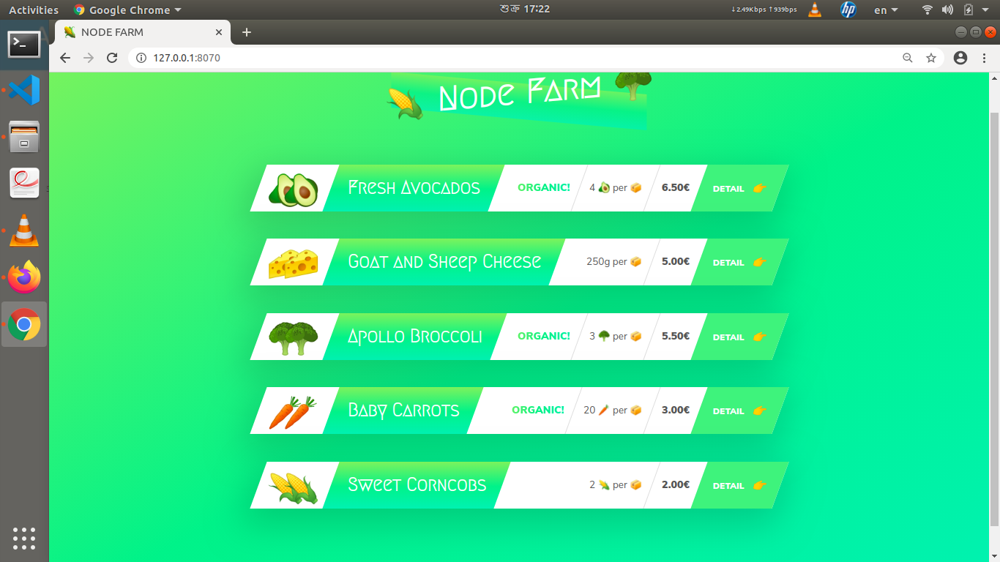
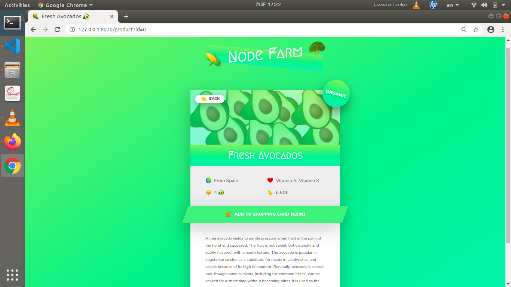

#node-farm
Node farm project created by using nodejs, css and html.

In this project created a server by using nodejs and did not used any thrid pary package for routing.

This project is for the begainer, if anyone want to learn about very basic about nodejs, this project is for him.

